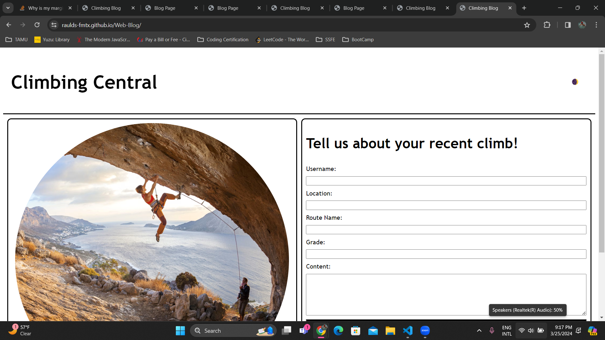

# Web-Blog

## Description

A Climbing blog that enables users to log their climbs and discuss them with fellow climbers by saving their blog posts to local storage. In addition, a dark/light mode toggle is enabled for the site.

## Link

[Click Here to Deploy Page](https://raulds-fmtx.github.io/Web-Blog/)

## Usage

To use this climbing blog, enter your username, the location of the route you completed, the name of the route, its grade, and your thoughts and opinions on the climb into the form on the main page. Upon clicking submit, the blog page will load where previous blog posts can be viewed. To make a new blog post, simply click the 'Back' button.

To toggle the dark/light modes, simply click the sun/moon icon at the top of the page.

My contact information is included at the botoom of the blog page.

## Credits

Created by Raul Santos

## License

Please refer to the LICENSE in the repo.
